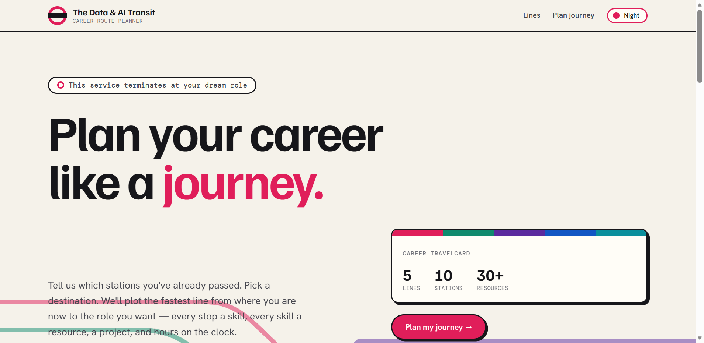
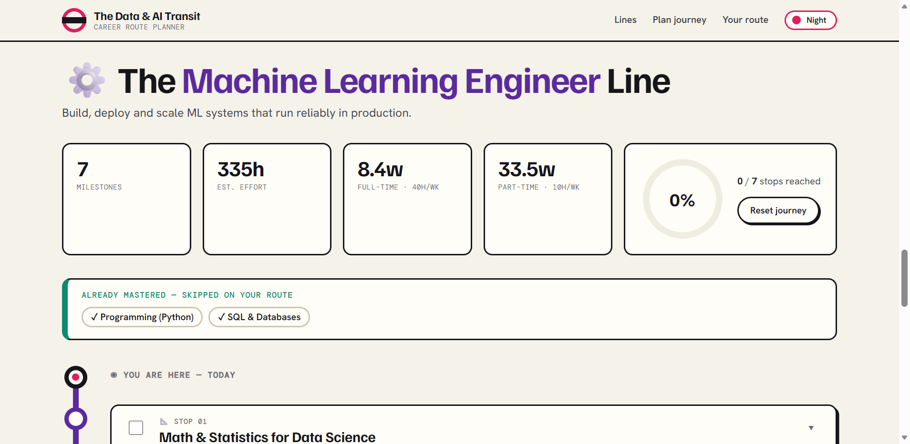

<div align="center">

# 🚇 The Data &amp; AI Transit — Career Route Planner

**Plan your career like a journey.** A data-driven web app that plots a personalized learning route
into Data &amp; AI/ML careers, presented as a **transit map**: careers are colored **lines**, skills are
**stations**, and your plan is the route from *"you are here"* to the role you want.

Tell it which stations you've passed → pick a destination → get a step-by-step route with curated
resources, real projects, effort estimates, and a progress tracker you can print to PDF.

[](https://github.com/prajwal3244/Career-learning-road-map/actions/workflows/ci.yml)
[](https://www.python.org/)
[](https://flask.palletsprojects.com/)
[](LICENSE)



</div>

---

## ✨ What it does

Most "roadmap" resources are one-size-fits-all. **Field Guide personalizes** the plan to *you*:

- **📊 Skill survey** — rate yourself across 10 core Data/AI skills (Python, stats, SQL, ML, deep learning, **GenAI/LLM**, MLOps, data engineering…).
- **🎯 5 career tracks** — Data Analyst · Data Scientist · ML Engineer · **AI/LLM Engineer** · Data Engineer, each with indicative salary bands and demand.
- **🧠 A real roadmap engine** — skills you already meet the bar for are **skipped and acknowledged** ("already mastered"); weaker skills are prioritized and labelled *Foundations* vs *Level&nbsp;up*.
- **📚 Curated resources** — 30+ hand-picked free &amp; paid resources (fast.ai, Kaggle, StatQuest, Hugging Face, DeepLearning.AI, Made With ML…), tagged by type and cost.
- **🛠 A field assignment per milestone** — every stage ends with a concrete portfolio project.
- **⏱ Effort math** — total hours plus full-time and part-time timelines.
- **✅ Progress tracking** — mark milestones reached; progress is saved in your browser (keyed on **stable stage ids**, so it survives re-assessment) and shown on a completion meter.
- **🖨 Print / Save-as-PDF**, **🌗 warm light &amp; dark themes**, fully responsive, keyboard-navigable, and WCAG-AA contrast.

<div align="center"></div>

## 🎨 Design

A deliberately distinctive **transit-map** concept — inspired by classic metro maps (Vignelli/Johnston).
Careers render as colored **lines** with tube **roundels**, skills become **stations**, and your route is
drawn as a single colored line running from a *"you are here"* origin through **interchanges** (capstone)
to a **terminus** (landing the role). Bold display type (Familjen Grotesk), a humanist body (Hanken
Grotesk), monospace signage (DM Mono), a "day service" light theme and a "night service" dark theme.
No template look, no generic AI aesthetic.

## 🖥️ Tech stack

| Layer      | Choice |
| ---------- | ------ |
| Backend    | **Python + Flask** — REST API + server-rendered shell |
| Curriculum | **JSON data file** — logic and content are cleanly separated (`data/roadmap.json`) |
| Frontend   | **Vanilla JS + modern CSS** — no build step, no framework lock-in |
| Storage    | **localStorage** — client-side progress, no database required |
| Quality    | **pytest** (22 tests) · **ruff** · **GitHub Actions** CI across Python 3.10–3.12 |

> The roadmap **engine** (`generate_roadmap` in `app.py`) is decoupled from the **curriculum data**
> (`data/roadmap.json`), so you can add careers, skills, or resources by editing JSON — no Python changes.

## 📂 Project structure

```
Career-learning-road-map/
├── app.py                    # Flask app: roadmap engine + API + security headers
├── data/
│   └── roadmap.json          # Curriculum: skills, careers, modules, resources
├── templates/index.html      # App shell
├── static/
│   ├── css/style.css         # Field-guide theme, route timeline, components
│   └── js/app.js             # UI building, route rendering, progress tracking
├── tests/test_roadmap.py     # 22 unit + API tests
├── .github/workflows/ci.yml  # Lint + test matrix
├── assets/                   # README screenshots
├── requirements.txt          # Runtime deps (pinned) + gunicorn
├── requirements-dev.txt      # + pytest, ruff
├── Procfile                  # web: gunicorn app:app
├── LICENSE                   # MIT
├── .gitignore
└── README.md
```

## 🚀 Getting started

**Prerequisites:** Python 3.10+

```bash
git clone https://github.com/prajwal3244/Career-learning-road-map.git
cd Career-learning-road-map

python -m venv .venv
# Windows:  .venv\Scripts\activate
# macOS/Linux:  source .venv/bin/activate

pip install -r requirements.txt
python app.py
```

Open **http://127.0.0.1:5001** in your browser.

> **Config via env vars:** `PORT` (default `5001`), `HOST` (default `127.0.0.1`), and `FLASK_DEBUG=1`
> to enable the dev debugger + live curriculum reload. Debug is **off** by default.

## 🧪 Tests &amp; linting

```bash
pip install -r requirements-dev.txt
ruff check .
pytest -q          # 22 passed
```

## ☁️ Deploy

The app is production-ready with **gunicorn** and a **Procfile** — deploy free on Render, Railway, or Fly.io:

```bash
gunicorn app:app   # serves the same app with debug off
```

## 🔐 Accounts

Register / login is built in — SQLite user store, salted password hashing
(`werkzeug.security`), signed session cookies (`HttpOnly`, `SameSite=Lax`),
CSRF-protected forms, and open-redirect-safe `next` handling. On-theme pages:
**"Get a Travelcard"** (register) and **"Tap in"** (login).

```bash
# Set a real secret in production (dev has a stable fallback):
export SECRET_KEY="$(python -c 'import secrets; print(secrets.token_hex(32))')"
export SESSION_COOKIE_SECURE=1   # when served over HTTPS
```

The user database (`data/users.db`) is created automatically on first run and is git-ignored.

## 🔌 API &amp; routes

| Method | Endpoint        | Description |
| ------ | --------------- | ----------- |
| `GET`  | `/`             | The web app |
| `GET`/`POST` | `/register` · `/login` | Account pages |
| `POST` | `/logout`       | End the session (CSRF-protected) |
| `GET`  | `/api/config`   | Available skills and careers (the frontend builds its UI from this) |
| `POST` | `/api/roadmap`  | Body `{ "career": "data-scientist", "skills": { "programming": 40, ... } }` → personalized route |
| `GET`  | `/healthz`      | Health check |

```bash
curl -X POST http://127.0.0.1:5001/api/roadmap \
  -H "Content-Type: application/json" \
  -d '{"career":"data-scientist","skills":{"programming":30,"math_stats":20,"sql_databases":70}}'
```

## 🧩 Extending the curriculum

Everything is data. To add a resource, skill, or a whole career track, edit **`data/roadmap.json`**:

- `skills[]` — the assessable skills
- `careers[]` — each role, its `core_skills`, salary/demand, and a `capstone`
- `modules{}` — per-skill learning module (threshold, objectives, resources, project)
- `closing_stage` — the universal portfolio + interview-prep finale

No Python edits required.

## 🗺️ Roadmap (future ideas)

- [ ] User accounts + server-side progress (Postgres)
- [ ] Real quiz-based skill assessment (vs self-rating)
- [ ] Resume upload with automatic skill inference
- [ ] Shareable route links

## 📝 License

[MIT](LICENSE).

---

<div align="center">

Built by [**Prajwal**](https://github.com/prajwal3244) — a full-stack portfolio project demonstrating
backend, frontend, data modeling, product design, and testing/CI discipline for Data/AI roles.

⭐ If this helped you, consider starring the repo.

</div>
